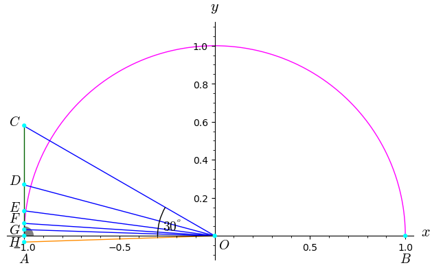

This section contains Python scripts that can be used to calculate the circle number Pi. Once completed, one will find here Python scripts that are based directly on Archimedes' ideas.

It should be noted that Python works with a limited number of decimal places by default. This is also valid for square roots from the standard module 'math'. To avoid this problem, the standard Python module 'decimal' can be used. Take also a look at the docstrings in the Python scripts with respect to the aforementioned comment.

Based on Archimedes' approach, further algorithms were developed to calculate both the lower limit and the upper limit as well as Pi as the mean value of the lower and upper limits.

As soon as I have a little more time, I will explain in more detail how the corresponding equations can be derived from the geometric relationships. 

